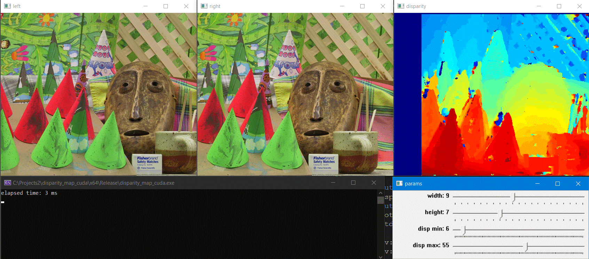

# Disparity Map (CUDA implementation)

This project implements disparity map calculation using CUDA acceleration for rectified stereo images. The implementation supports multiple cost functions, allowing for flexible and efficient computation of disparity maps. 


## Features

- CUDA-accelerated disparity calculation
- Cost functions:
  - Sum of Absolute Differences (SAD)
  - Sum of Squared Differences (SSD)
  - Normalized Cross-Correlation (NCC)
  - Zero-mean Normalized Cross-Correlation (ZNCC)




## Requirements
- Windows Visual  Studio
- OpenCV (set OPENCV_DIR variable in environment variables)
- RealSense  (set REALSENSE variable in environment variables)
- CUDA 


# Usage example

```
    // define matching parameters
    StereoParams params = { 5, 5, 0, 60, CostFunction::SAD, CostOptimizer::COSTMIN };
    // create disparity object
    Disparity dsp(params, img1.size().width, img1.size().height, img1.channels());
    // run matching algorithm
    dsp.Match(img1, img2, disp);

```

